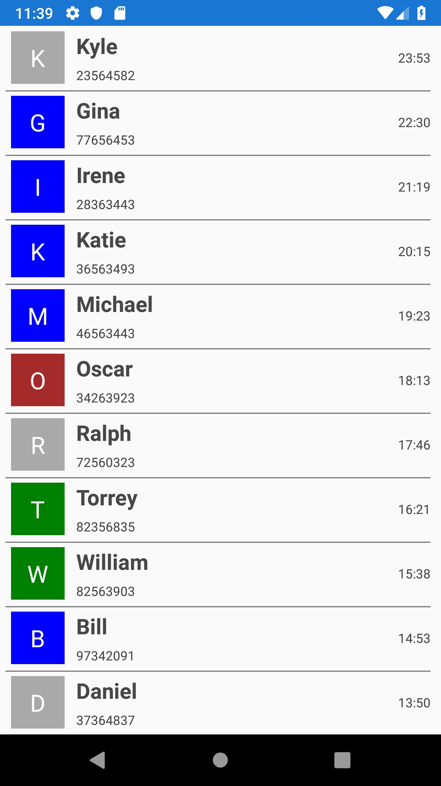

Custom ListView
================

This repository demonstrates how to create a custom control in Xamarin.Forms. Here I have created a simple ListView that reuses the items similar to RecyclerView in Android. The custom control is exposed with 3 bindable properties to bind the data to the list view, item template for the list item and to customize the height of the list item. 

The below XAML demonstrates the code required to configure the custom ListView created from the XAML. 

<?xml version="1.0" encoding="utf-8" ?>
<ContentPage xmlns="http://xamarin.com/schemas/2014/forms"
             xmlns:x="http://schemas.microsoft.com/winfx/2009/xaml"
             xmlns:local="clr-namespace:CustomControl"
             xmlns:iOS="clr-namespace:Xamarin.Forms.PlatformConfiguration.iOSSpecific;assembly=Xamarin.Forms.Core"
             iOS:Page.UseSafeArea="True"
             x:Class="CustomControl.MainPage"
             Padding="5,5,10,5">

    <ContentPage.BindingContext>
        <local:ContactsViewModel x:Name="viewModel" />
    </ContentPage.BindingContext>

    <local:SimpleListView ItemHeight="60"
                          ItemsSource="{Binding Contacts}">
        <local:SimpleListView.ItemTemplate>
            <DataTemplate>
                <StackLayout>
                    <Grid>
                        <Grid.ColumnDefinitions>
                            <ColumnDefinition Width="60" />
                            <ColumnDefinition Width="*" />
                            <ColumnDefinition Width="Auto" />
                        </Grid.ColumnDefinitions>
                        <ContentView Padding="5, 0, 5, 0">
                            <Label Text="{Binding ContactImage}" BackgroundColor="{Binding ContactImageColor}" TextColor="White" FontSize="Large"  HorizontalOptions="FillAndExpand" VerticalOptions="FillAndExpand" HorizontalTextAlignment="Center" VerticalTextAlignment="Center" />
                        </ContentView>
                        <StackLayout Grid.Column="1">
                            <Label LineBreakMode="NoWrap" TextColor="#474747" Text="{Binding ContactName}" FontAttributes="Bold" VerticalTextAlignment="Center" />
                            <Label TextColor="#474747" LineBreakMode="NoWrap" Text="{Binding ContactNumber}" VerticalTextAlignment="Center" HorizontalTextAlignment="Start" />
                        </StackLayout>
                        <Label Grid.Column="2" TextColor="#474747" LineBreakMode="NoWrap" Text="{Binding CallTime}" VerticalTextAlignment="Center" HorizontalTextAlignment="Start" />
                    </Grid>
                    <BoxView BackgroundColor="Gray"  HeightRequest="1" />
                </StackLayout>
            </DataTemplate>
        </local:SimpleListView.ItemTemplate>
    </local:SimpleListView>
</ContentPage>

The outcome for binding a simple contact information is shown below. 

Author
======

Harikrishnan